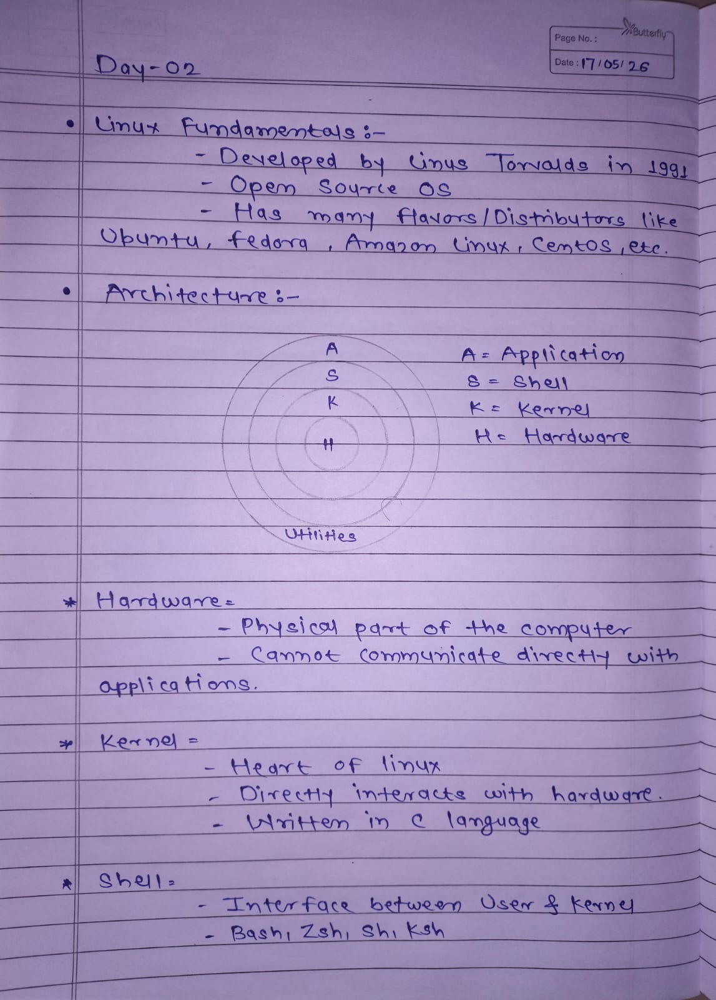
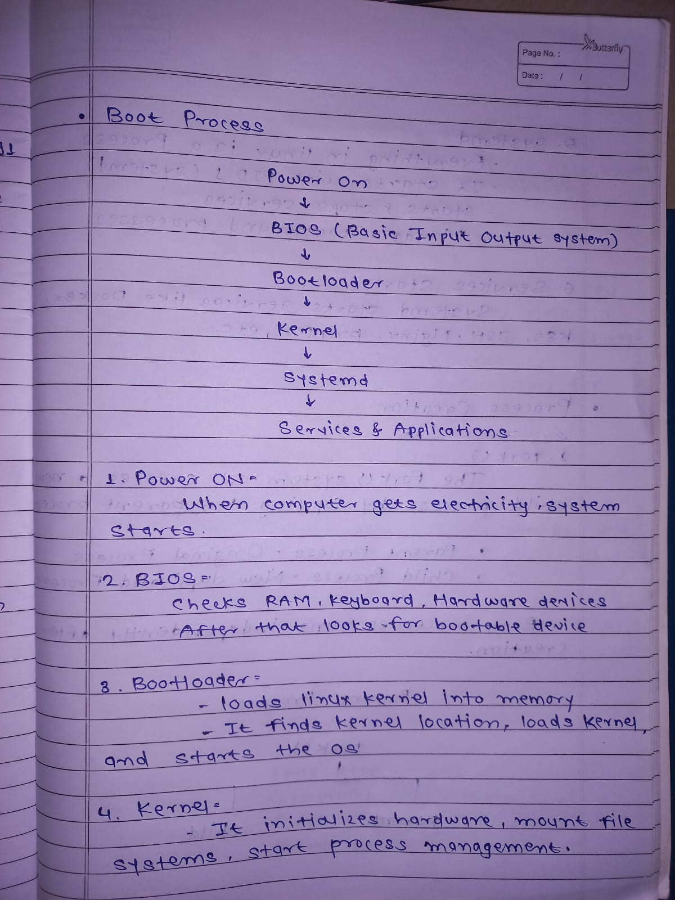
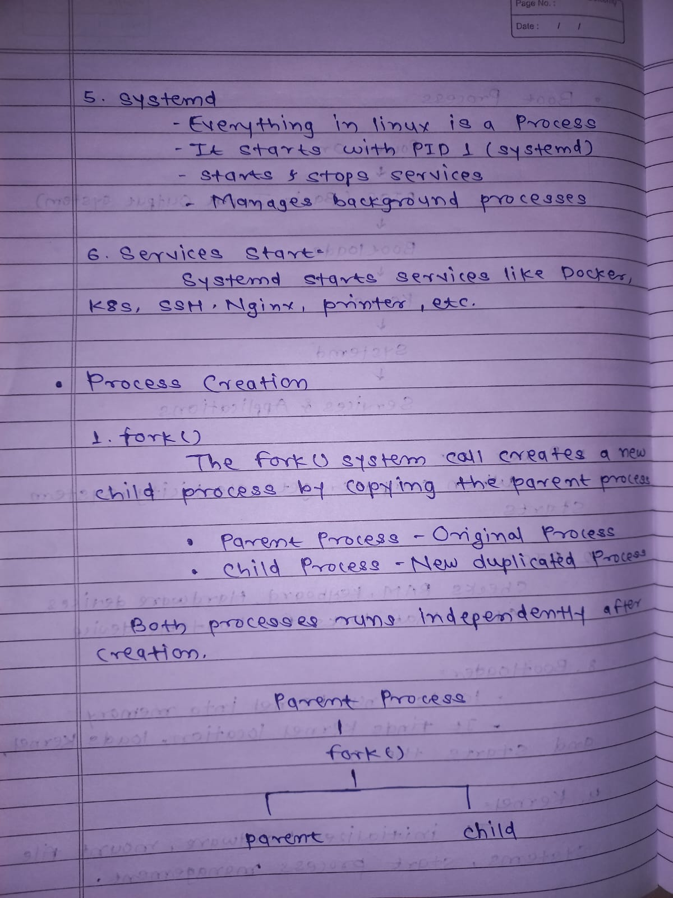
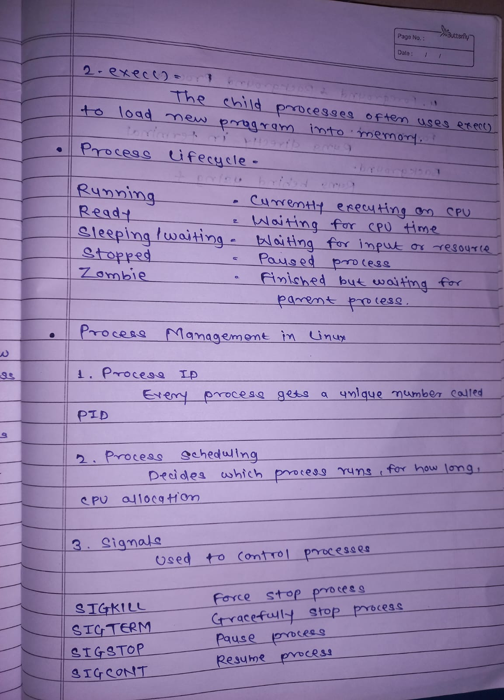
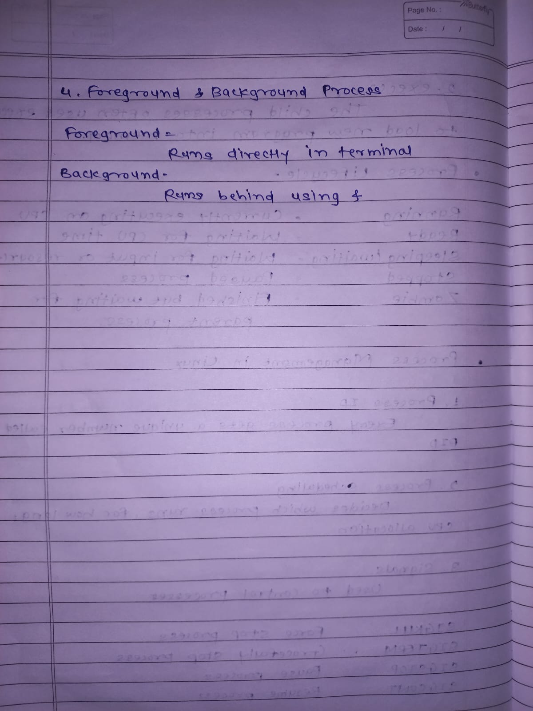

# Day 02 - Linux Architecture & Process Management

## Linux Fundamentals & Architecture

---

## Linux Boot Process

---

## Process Creation & systemd

---

## Process Lifecycle & Signals

---

## Foreground & Background Processes

